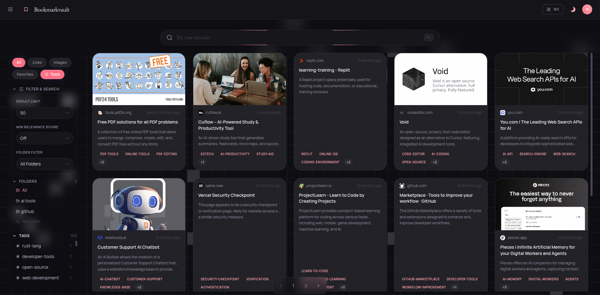
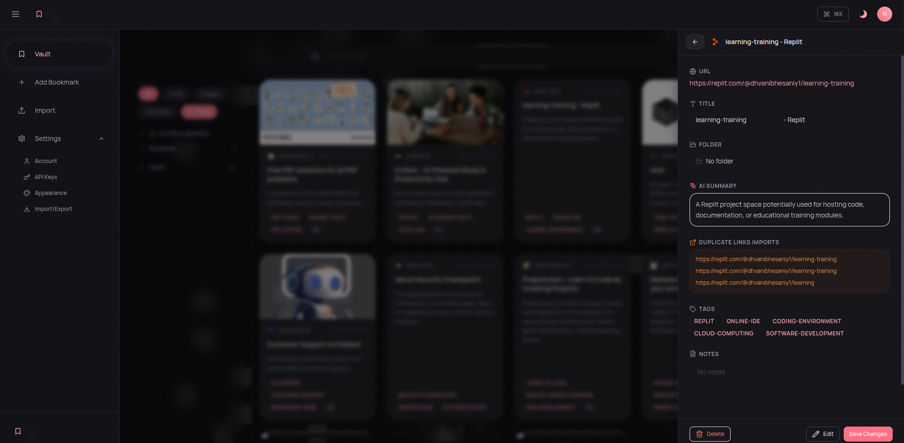
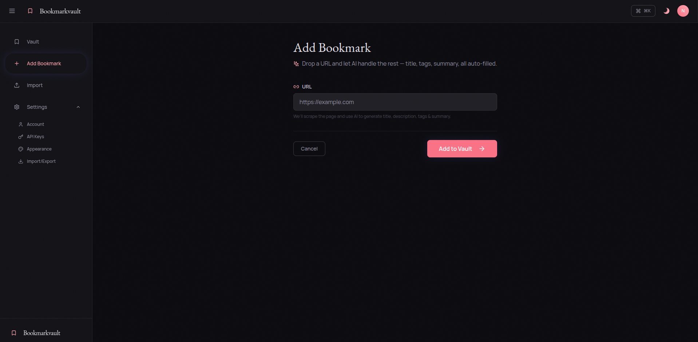
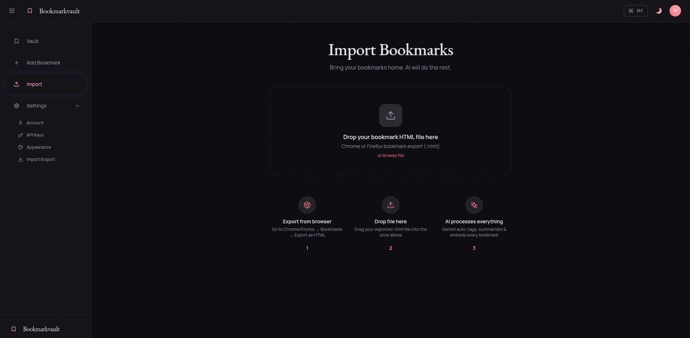
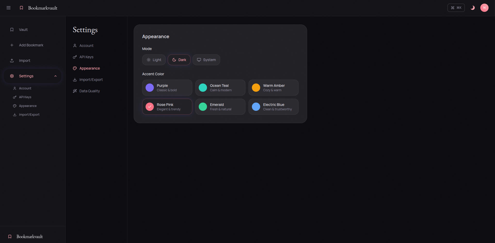
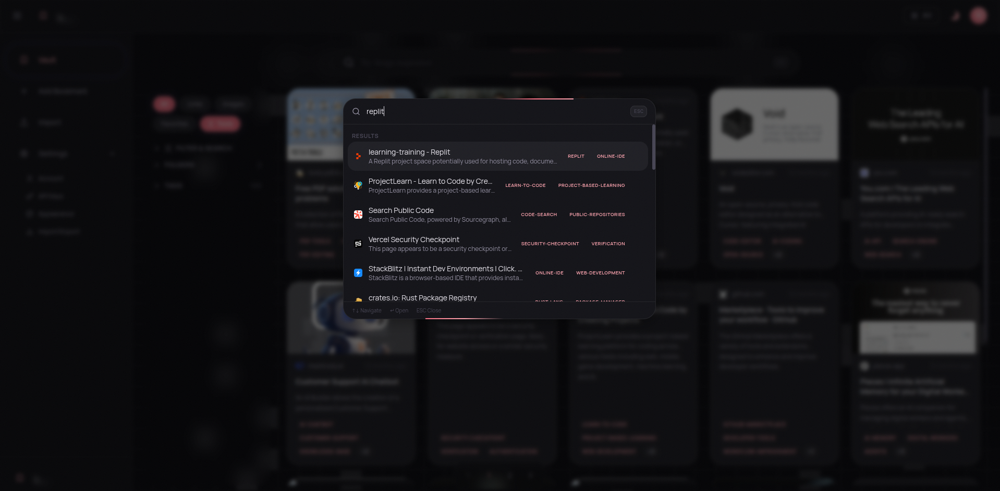
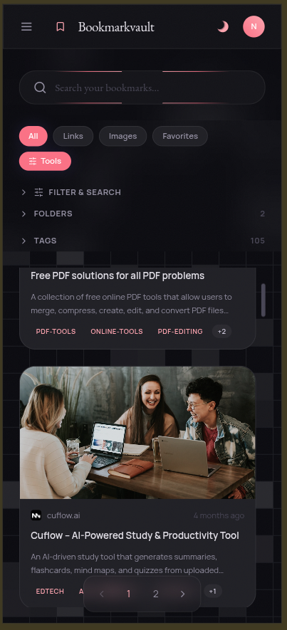
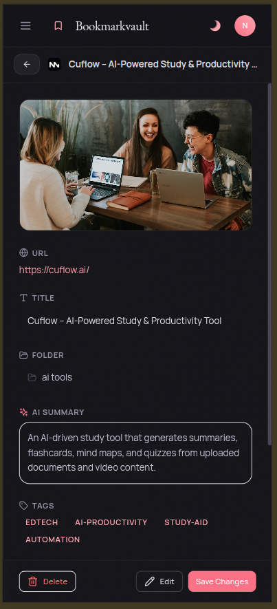
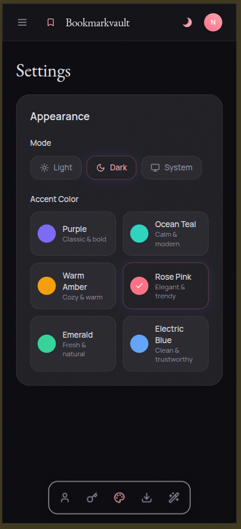

<div align="center">

# 🔖 Bookmarkvault

**AI-powered bookmark manager with semantic search, smart tagging, and a premium dark UI.**

Built with **Rust (Axum)** · **React (Vite + Tailwind)** · **MongoDB Atlas** · **Google Gemini AI**

[](LICENSE)

</div>

---



## ✨ Features

### 🤖 AI-Powered Intelligence
- **Auto Tagging** — Gemini AI generates relevant tags for every bookmark automatically
- **AI Summaries** — Get concise, one-line summaries of any saved URL
- **Semantic Search** — Find bookmarks by meaning, not just keywords, using vector embeddings
- **Smart Metadata** — Automatically fetches title, description, favicon, and OG image from URLs

### 📂 Organization
- **Collections/Folders** — Organize bookmarks into nested collections
- **Favorites** — Quick-access your most important bookmarks
- **Tag Filtering** — Filter bookmarks by AI-generated or custom tags
- **Duplicate Detection** — Automatically detects and tracks duplicate URLs per domain

### 🔍 Hybrid Search
- **Vector + Text** — Combines 70% semantic similarity with 30% text relevance
- **Automatic Fallback** — Gracefully degrades from vector → text → regex search
- **Collection-Aware** — Search within specific collections or across all bookmarks

### 📥 Bulk Import
- **Browser Export Support** — Import HTML bookmark exports from Chrome, Firefox, Edge, Safari
- **Background Processing** — Imports run asynchronously with real-time progress tracking
- **Batch AI Enrichment** — Tags and summaries generated in batches during import
- **Settings Integration** — Import flow is directly accessible from **Settings → Import / Export**

### 💾 Export Utilities
- **JSON Export** — Download all bookmarks as a structured JSON backup
- **HTML Export** — Download browser-compatible Netscape Bookmark HTML

### 🛠️ Data Quality Tools
- **Reprocess All** — Dispatch every bookmark for full AI re-enrichment (scrape + tags + summary + embedding)
- **Reprocess Selected** — Pick a single bookmark and let AI generate a better title on demand
- **Reprocess Weak Titles** — Auto-detect bookmarks with low-quality titles (e.g. "Just a moment...", "404", Cloudflare pages) and re-enrich them
- **Smart Title Generation** — AI generates proper titles when scrapers return garbage (Cloudflare challenges, security pages)
- **Refresh on Demand** — Bookmark list in Data Quality loads once, then refreshes only when you click the refresh button

### 🖼️ Image Preferences
- **Image Source Selector** — Each bookmark detail has a dropdown overlay to choose between the original OG image or a default placeholder
- **Per-Bookmark Setting** — Image preference is saved to the database and respected across card grid and detail views

### 🎨 Premium UI
- **Nocturne Noir Design** — Dark-first aesthetic with glassmorphism and ambient shadows
- **Light & Dark Themes** — Full theme system with light, dark, and system-auto modes
- **Responsive** — Works beautifully on desktop, tablet, and mobile
- **Command Palette** — Quick navigation with `⌘K` / `Ctrl+K` shortcut
- **Smooth Animations** — Framer Motion powered transitions throughout

---

## 📸 Screenshots

<details open>
<summary><strong>Desktop Views</strong></summary>

| Main Dashboard | Bookmark Details |
|:-:|:-:|
|  |  |

| Add Bookmark | Import Bookmarks |
|:-:|:-:|
|  |  |

| Settings | Command Palette (⌘K) |
|:-:|:-:|
|  |  |

</details>

<details open>
<summary><strong>Mobile Views</strong></summary>

| Home | Bookmark Details | Settings |
|:-:|:-:|:-:|
|  |  |  |

</details>

---

## 🏗️ Tech Stack

### Backend (Rust)
| Technology | Purpose |
|---|---|
| [Axum](https://github.com/tokio-rs/axum) 0.7 | HTTP framework with async handlers |
| [Tokio](https://tokio.rs/) 1.x | Async runtime |
| [MongoDB Driver](https://github.com/mongodb/mongo-rust-driver) 3.x | Database client |
| [Tower-HTTP](https://github.com/tower-rs/tower-http) 0.5 | CORS, tracing, static file serving |
| [Reqwest](https://github.com/seanmonstar/reqwest) 0.12 | HTTP client for scraping & AI calls |
| [jsonwebtoken](https://github.com/Keats/jsonwebtoken) 9.x | JWT authentication |
| [bcrypt](https://github.com/Keats/rust-bcrypt) 0.15 | Password hashing |
| [scraper](https://github.com/causal-agent/scraper) 0.19 | HTML metadata extraction |
| Google Gemini API | AI tagging, summaries & embeddings |

### Frontend (React)
| Technology | Purpose |
|---|---|
| [React](https://react.dev/) 18.3 | UI framework |
| [Vite](https://vite.dev/) 8.x | Build tool & dev server |
| [Tailwind CSS](https://tailwindcss.com/) 3.4 | Utility-first styling |
| [TanStack Query](https://tanstack.com/query) 5.x | Server state management |
| [Zustand](https://github.com/pmndrs/zustand) 4.x | Client state management |
| [Framer Motion](https://www.framer.com/motion/) 11.x | Animations |
| [Radix UI](https://www.radix-ui.com/) | Accessible UI primitives |
| [cmdk](https://cmdk.paco.me/) | Command palette |
| [Axios](https://axios-http.com/) | HTTP client |
| [React Router](https://reactrouter.com/) 6.x | Client-side routing |

### Infrastructure
| Technology | Purpose |
|---|---|
| MongoDB Atlas | Cloud database + vector search |
| Render.com | Deployment platform |
| Docker | Containerized production builds |

---

## 📁 Project Structure

```
bookmark-vault/
├── package.json            # Root scripts (build, dev, start)
├── render.yaml             # Render.com deployment config
│
├── backend/                # Rust API server
│   ├── Cargo.toml
│   ├── Dockerfile          # Multi-stage build (Node + Rust)
│   └── src/
│       ├── main.rs                  # Entry point, static file serving
│       ├── routes/mod.rs            # Route aggregation
│       ├── middleware/auth.rs       # JWT auth middleware
│       ├── auth_operations/         # Register & login
│       ├── bookmark_operations/     # CRUD, import, reprocess
│       ├── collection_operations/   # Folder management
│       ├── search_operations/       # Hybrid search & tags
│       └── utils/
│           ├── config.rs            # Environment configuration
│           ├── db.rs                # MongoDB connection & indexes
│           ├── errors.rs            # Error types
│           ├── gemini.rs            # Gemini AI client
│           └── scraper.rs           # URL metadata scraper
│
├── frontend/               # React SPA
│   ├── package.json
│   ├── vite.config.js      # Dev proxy → backend
│   └── src/
│       ├── components/      # UI components
│       ├── hooks/           # React Query hooks
│       ├── pages/           # Route pages
│       ├── store/           # Zustand auth store
│       └── lib/             # API client, utils, constants
│
└── product-roadmap/        # Planning docs
```

---

## 🚀 Getting Started

### Prerequisites

- **Rust** (stable toolchain) — [Install](https://rustup.rs/)
- **Node.js** ≥ 18 & npm — [Install](https://nodejs.org/)
- **MongoDB Atlas** cluster — [Create free cluster](https://www.mongodb.com/atlas)
- **Google Gemini API Key** — [Get API key](https://aistudio.google.com/apikey)

### 1. Clone the repository

```bash
git clone https://github.com/DhvaniBhesaniya/bookmark-vault.git
cd bookmark-vault
```

### 2. Set up environment variables

Create `backend/.env`:

```env
MONGODB_URI=mongodb+srv://<user>:<password>@<cluster>.mongodb.net/?retryWrites=true&w=majority
DATABASE_NAME=Bookmarkvault
PORT=8080
CORS_ORIGIN=http://localhost:5173
JWT_SECRET=your-secret-key-change-this
GEMINI_API_KEY_1=your-gemini-api-key
# Optional: add more keys for rate-limit resilience
# GEMINI_API_KEY_2=another-key
# GEMINI_API_KEY_3=another-key
```

> **Tip**: You can configure up to 5 Gemini API keys (`GEMINI_API_KEY_1` through `GEMINI_API_KEY_5`) for automatic key rotation when rate limits are hit.

### 3. Set up MongoDB Vector Search Index

To enable semantic search, create a vector search index in MongoDB Atlas:

1. Go to **Atlas Dashboard** → your cluster → **Database** → `Bookmarkvault` → `bookmarks` collection
2. Navigate to **Atlas Search** tab → **Create Search Index**
3. Select **Atlas Vector Search — JSON Editor**
4. Name the index **`vector_index`** (this exact name is required)
5. Paste the following configuration:

```json
{
  "fields": [
    {
      "numDimensions": 3072,
      "path": "embedding",
      "similarity": "cosine",
      "type": "vector"
    },
    {
      "path": "user_id",
      "type": "filter"
    }
  ]
}
```

6. Click **Create** and wait for the index to build

> **Note**: Semantic search works without this index — it will automatically fall back to text search.

### 4. Run the application

#### Option A: Single command (build + run)

```bash
npm run dev
```

This builds the frontend and starts the Rust backend on `http://localhost:8080`.

#### Option B: Development with hot reload (two terminals)

**Terminal 1** — Backend:
```bash
cd backend
cargo run
```

**Terminal 2** — Frontend with hot reload:
```bash
cd frontend
npm install
npm run dev
```

Frontend dev server runs on `http://localhost:5173` and proxies `/api` requests to the backend.

#### Option C: Production-style build

```bash
npm run build    # Build frontend
npm run start    # Start backend in release mode
```

Open `http://localhost:8080` — the backend serves both the API and the frontend.

---

## 🔌 API Reference

All endpoints are prefixed with `/api/v1`. Protected routes require a `Bearer` token in the `Authorization` header.

### Authentication (Public)

| Method | Endpoint | Description |
|--------|----------|-------------|
| `POST` | `/api/v1/auth/register` | Create a new account |
| `POST` | `/api/v1/auth/login` | Login and receive JWT token |

### Authentication (Protected)

| Method | Endpoint | Description |
|--------|----------|-------------|
| `POST` | `/api/v1/auth/change-password` | Change the logged-in user's password |

### Bookmarks (Protected)

| Method | Endpoint | Description |
|--------|----------|-------------|
| `GET` | `/api/v1/bookmarks` | List bookmarks (paginated, filterable) |
| `POST` | `/api/v1/bookmarks` | Create a bookmark (async AI processing) |
| `GET` | `/api/v1/bookmarks/:id` | Get bookmark details |
| `PUT` | `/api/v1/bookmarks/:id` | Update bookmark fields |
| `DELETE` | `/api/v1/bookmarks/:id` | Delete a bookmark |
| `POST` | `/api/v1/bookmarks/import` | Bulk import from HTML file |
| `GET` | `/api/v1/bookmarks/import/status/:job_id` | Check import job progress |
| `POST` | `/api/v1/bookmarks/reprocess-weak` | Re-enrich incomplete bookmarks |
| `POST` | `/api/v1/bookmarks/reprocess-all` | Dispatch all bookmarks for full reprocess |
| `POST` | `/api/v1/bookmarks/:id/reprocess` | AI title regeneration for a single bookmark |

### Search (Protected)

| Method | Endpoint | Description |
|--------|----------|-------------|
| `GET` | `/api/v1/search` | Hybrid semantic + text search |
| `GET` | `/api/v1/search/tags` | Get all unique tags |

### Collections (Protected)

| Method | Endpoint | Description |
|--------|----------|-------------|
| `GET` | `/api/v1/collections` | List all collections |
| `POST` | `/api/v1/collections` | Create a collection |
| `PUT` | `/api/v1/collections/:id` | Rename a collection |
| `DELETE` | `/api/v1/collections/:id` | Delete a collection |

### Health

| Method | Endpoint | Description |
|--------|----------|-------------|
| `GET` | `/health` | Server health check |

---

## ⚙️ Environment Variables

### Backend (`backend/.env`)

| Variable | Required | Default | Description |
|----------|----------|---------|-------------|
| `MONGODB_URI` | Yes | `mongodb://localhost:27017` | MongoDB connection string |
| `DATABASE_NAME` | No | `Bookmarkvault` | Database name |
| `PORT` | No | `8080` | Server port |
| `CORS_ORIGIN` | No | `http://localhost:5173` | Allowed CORS origin |
| `JWT_SECRET` | Yes | `dev-secret-change-me` | Secret for JWT signing |
| `GEMINI_API_KEY_1`..`5` | Yes* | — | Gemini API keys (rotation support) |
| `GEMINI_API_KEY` | Yes* | — | Legacy single key fallback |
| `SEARCH_MIN_SCORE` | No | — | Minimum search relevance (0.0–1.0) |
| `FRONTEND_DIST_DIR` | No | `../frontend/dist` | Path to frontend build output |

\* At least one Gemini key is needed for AI features. Without it, bookmarks save without tags/summaries/embeddings.

### Frontend (`frontend/.env`)

| Variable | Required | Default | Description |
|----------|----------|---------|-------------|
| `VITE_API_URL` | No | `/api/v1` | API base URL (override for split deploys) |

---

## 🐳 Docker

The project uses a multi-stage Dockerfile that builds both frontend and backend into a single image.

```bash
# Build from the repo root
docker build -f backend/Dockerfile -t bookmarkvault .

# Run
docker run -p 8080:8080 \
  -e MONGODB_URI="your-mongodb-uri" \
  -e JWT_SECRET="your-secret" \
  -e GEMINI_API_KEY_1="your-gemini-key" \
  -e FRONTEND_DIST_DIR="/usr/local/share/frontend/dist" \
  bookmarkvault
```

Open `http://localhost:8080` — everything is served from the single container.

---

## 🌐 Deployment (Render.com)

The included `render.yaml` deploys as a **single web service**:

1. Fork/push this repo to GitHub
2. Go to [Render Dashboard](https://dashboard.render.com/) → **Blueprints** → **New Blueprint Instance**
3. Connect your repository and select the `render.yaml`
4. Set the required secret environment variables (`MONGODB_URI`, `JWT_SECRET`, `GEMINI_API_KEY_1`)
5. Deploy — Render builds the Docker image and serves both API + frontend from one URL

---

## 🔄 How It Works

### Bookmark Processing Pipeline

```
User saves URL
     │
     ▼
┌─────────────┐    Immediate response
│ Save to DB  │───────────────────────► { id, status: "processing" }
│ (status:    │
│  processing)│
└──────┬──────┘
       │  Background task
       ▼
┌─────────────┐
│ Scrape URL  │  Fetch title, description, favicon, OG image
└──────┬──────┘
       ▼
┌─────────────┐
│ Gemini AI   │  Generate title + tags + summary (JSON mode)
└──────┬──────┘
       ▼
┌─────────────┐
│ Embedding   │  Generate 3072-dim vector for semantic search
└──────┬──────┘
       ▼
┌─────────────┐
│ Update DB   │  status: "ready", all fields populated
└─────────────┘
```

### Search Architecture

```
User query: "machine learning tutorials"
     │
     ▼
┌──────────────────┐
│ Generate query   │  Gemini embedding API
│ embedding vector │
└────────┬─────────┘
         │
    ┌────┴────┐
    ▼         ▼
┌────────┐ ┌────────┐
│ Vector │ │ Text   │
│ Search │ │ Search │
│  (70%) │ │  (30%) │
└───┬────┘ └───┬────┘
    └────┬─────┘
         ▼
┌──────────────────┐
│ Merge & rank     │  Hybrid scoring
│ results          │
└──────────────────┘
```

---

## 🧑‍💻 Development Tips

- **Hot reload**: Run frontend (`npm run dev` in `frontend/`) and backend (`cargo run` in `backend/`) separately for the best DX. Vite proxies API calls automatically.
- **Command Palette**: Press `⌘K` / `Ctrl+K` to open the command palette for quick navigation.
- **Multiple Gemini keys**: Configure up to 5 keys to avoid rate limits during bulk import.
- **Reprocess weak bookmarks**: Use the reprocess endpoint to re-enrich bookmarks that failed initial processing.

---

## ⚙️ Settings Capabilities

Current Settings sections and behavior:

- **Account**
  - View account email
  - Change password via `/api/v1/auth/change-password`
- **Appearance**
  - Theme mode: Light / Dark / System
  - Accent color selection
- **Import / Export**
  - Import bookmarks: opens the dedicated import flow page
  - Export as JSON: downloads all bookmarks with metadata
  - Export as HTML: downloads browser-compatible bookmark HTML
- **Data Quality**
  - **Run Process All**: dispatches every bookmark for full AI reprocessing via `/api/v1/bookmarks/reprocess-all`
  - **Run Selected**: searchable dropdown to pick a bookmark, then AI regenerates its title via `/api/v1/bookmarks/:id/reprocess`
  - **Run Weak-Only Reprocess**: auto-detects and re-enriches low-quality titles via `/api/v1/bookmarks/reprocess-weak`
  - **Refresh button**: manually reload the bookmark list (no continuous polling)
  - **Info tooltip**: hover/tap the glowing ℹ icon next to "Reprocess Weak Titles" for details

Note: API key input/testing UI has been intentionally removed from Settings. Gemini keys are configured on the backend through environment variables.

---

## 📄 License

This project is licensed under the MIT License — see the [LICENSE](LICENSE) file for details.

---

<div align="center">

**Made with ❤️ by [Dhvani Bhesaniya](https://github.com/DhvaniBhesaniya)**

</div>
